# Migration Toolkit (Removing Xamarin.Forms)

AI-assisted migration of Xamarin.Forms → UWP → WinUI applications using Claude Code, runtime inspection, and snapshot-based regression testing.

## Architecture

```mermaid
graph LR
    CC["🤖 Claude Code  (orchestrator)"]
    MCP["⚙️ MCP Server  (.NET 10)"]
    SPY["👁️ AppSpy  (in UWP app)"]
    VT["🖼️ UWP Visual Tree"]
    FR["▶️ Flow Runner  (.NET 10)"]
    ROS["🔍 Roslyn Engine"]
    BUILD["🔨 dotnet build"]

    CC <-->|"stdio  (MCP JSON-RPC)"| MCP
    MCP <-->|"named pipe  (StreamJsonRpc)"| SPY
    SPY <-->|"UI thread  dispatch"| VT
    FR <-->|"named pipe  (StreamJsonRpc)"| SPY
    MCP --> ROS
    MCP --> BUILD

    style CC fill:#7c3aed,color:#fff,stroke:none
    style MCP fill:#2563eb,color:#fff,stroke:none
    style SPY fill:#059669,color:#fff,stroke:none
    style VT fill:#059669,color:#fff,stroke:none
    style FR fill:#d97706,color:#fff,stroke:none
    style ROS fill:#2563eb,color:#fff,stroke:none
    style BUILD fill:#2563eb,color:#fff,stroke:none
```



Claude Code reads your source, inspects the running app through the spy, migrates code, builds, and verifies the result by comparing before/after snapshots — all through MCP tools.

## Migration Workflow

```mermaid
graph TD
    A["📸 Capture Baselines  Snapshot all screens — phase=xf"]
    B["✏️ Migrate XAML  Claude transforms XF → UWP"]
    C["🔨 Build & Fix  Auto-fix known errors"]
    D["📸 Verify  Snapshot same screens — phase=uwp"]
    E{"🔍 Compare  Snapshots"}
    F["✅ Screen Done"]
    G["🔧 Fix Regressions"]

    A --> B --> C --> D --> E
    E -->|"✓ Match"| F
    E -->|"🚩 Regression"| G --> C
    F -->|"Next screen"| B

    style A fill:#7c3aed,color:#fff,stroke:none
    style B fill:#2563eb,color:#fff,stroke:none
    style C fill:#d97706,color:#fff,stroke:none
    style D fill:#7c3aed,color:#fff,stroke:none
    style E fill:#475569,color:#fff,stroke:none
    style F fill:#059669,color:#fff,stroke:none
    style G fill:#dc2626,color:#fff,stroke:none
```



## Regression Testing

```mermaid
graph LR
    subgraph BEFORE["Phase: xf — before migration"]
        XF["XF App"] --> UWP1["UWP Controls"] --> SPY1["Spy captures  abstract state"]
        SPY1 --> SNAP1["📸 xf_Login_Empty  📸 xf_Login_Filled  📸 xf_Dashboard"]
    end

    subgraph AFTER["Phase: uwp — after migration"]
        NUWP["Native UWP App"] --> UWP2["UWP Controls"] --> SPY2["Spy captures  abstract state"]
        SPY2 --> SNAP2["📸 uwp_Login_Empty  📸 uwp_Login_Filled  📸 uwp_Dashboard"]
    end

    SNAP1 --> DIFF["🤖 Claude  Compares"]
    SNAP2 --> DIFF
    DIFF --> R1["✓ Match"]
    DIFF --> R2["⚠ Minor"]
    DIFF --> R3["🚩 Regression"]

    style BEFORE fill:#1e1b4b,color:#fff,stroke:#4338ca
    style AFTER fill:#052e16,color:#fff,stroke:#16a34a
    style DIFF fill:#7c3aed,color:#fff,stroke:none
    style R1 fill:#059669,color:#fff,stroke:none
    style R2 fill:#d97706,color:#fff,stroke:none
    style R3 fill:#dc2626,color:#fff,stroke:none
```



## Flow Runner Pipeline

```mermaid
graph LR
    DEV["👤 Developer writes  flows.md  (plain English)"]
    REG["📋 screens.json  control IDs, states,  test data"]
    CLAUDE["🤖 Claude generates  flows/*.json  (step-by-step metadata)"]
    RUNNER["▶️ Flow Runner  executes deterministically  — no AI needed"]
    RESULT["📊 Results  ✓ pass / ✗ fail  + snapshots"]

    DEV --> CLAUDE
    REG --> CLAUDE
    CLAUDE --> RUNNER --> RESULT

    style DEV fill:#475569,color:#fff,stroke:none
    style REG fill:#475569,color:#fff,stroke:none
    style CLAUDE fill:#7c3aed,color:#fff,stroke:none
    style RUNNER fill:#d97706,color:#fff,stroke:none
    style RESULT fill:#059669,color:#fff,stroke:none
```



Write tests in plain English:

```markdown
## login happy path
log in with valid user, verify dashboard loads with flights

## offline recovery
app: log in, verify dashboard loaded
sim: toggle offline mode on Device 1
app: click refresh, verify error shows
```

Claude converts these to deterministic JSON. Run without Claude:

```bash
dotnet run --project FlowRunner -- ./flows/
```

## Component Dependencies

```mermaid
graph BT
    SHARED["📦 Shared  (.NET Standard 2.0)  Models, ISpyService"]
    SPY["👁️ Spy  (.NET Standard 2.0)  SpyServer, UWPMapper,  ActionExecutor"]
    MCP["⚙️ MCP Server  (.NET 10)  SpyTools, BuildTools,  RoslynTools, Prompts"]
    FR["▶️ Flow Runner  (.NET 10)  JSON executor"]
    UWP["🖼️ UWP App Head  (your app)"]

    SPY --> SHARED
    MCP --> SHARED
    FR --> SHARED
    UWP -.->|"project ref  (DEBUG only)"| SPY

    MCP -.->|"named pipe"| SPY
    FR -.->|"named pipe"| SPY

    style SHARED fill:#475569,color:#fff,stroke:none
    style SPY fill:#059669,color:#fff,stroke:none
    style MCP fill:#2563eb,color:#fff,stroke:none
    style FR fill:#d97706,color:#fff,stroke:none
    style UWP fill:#7c3aed,color:#fff,stroke:none
```



## Build Order


Follow [REQUIREMENTS.md §10.2](REQUIREMENTS.md#102-build-order--day-1) for the detailed sequence.

## Screen Behavior Analysis

```mermaid
graph TD
    XAML["📄 XAML  bindings, controls"]
    VM["📄 ViewModel  properties, commands,  dependencies"]
    CB["📄 Code-Behind  event handlers"]
    SNAP["📸 Snapshots  runtime state"]

    XAML --> STATIC["🔍 Static Analysis  Roslyn + XDocument"]
    VM --> STATIC
    CB --> STATIC
    SNAP --> RUNTIME["👁️ Runtime Observation  actual control states"]

    STATIC --> XREF["🔗 Cross-Reference"]
    RUNTIME --> XREF

    XREF --> BEH["📋 screen-behaviors.json  WHEN/THEN statements,  untested states, warnings"]
    BEH -.->|"future"| TESTS["🧪 Unit Tests"]

    style STATIC fill:#2563eb,color:#fff,stroke:none
    style RUNTIME fill:#059669,color:#fff,stroke:none
    style XREF fill:#7c3aed,color:#fff,stroke:none
    style BEH fill:#d97706,color:#fff,stroke:none
    style TESTS fill:#475569,color:#fff,stroke:none
```



## Components

| Component | What | Framework |
|-----------|------|-----------|
| **Shared** | Abstract control model, interfaces, flow models | .NET Standard 2.0 |
| **AppSpy** | In-process UWP inspector over named pipe | .NET Standard 2.0 |
| **MCP Server** | Tool bridge between Claude Code and everything else | .NET 10 |
| **Flow Runner** | Deterministic UI test executor from JSON metadata | .NET 10 |

## Quick Start

### Prerequisites

- Windows 10/11, Visual Studio 2022 (UWP + Xamarin workloads)
- .NET 10 SDK, Node.js 18+, Claude Code CLI
- See [REQUIREMENTS.md §13](REQUIREMENTS.md#13-developer-workstation-prerequisites) for full setup

### 1. Build the toolkit

```bash
dotnet build migration-toolkit.sln
```

### 2. Wire spy into your UWP app

Add a project reference to the Spy library in your UWP head project, then in `App.xaml.cs`:

```csharp
protected override void OnLaunched(LaunchActivatedEventArgs e)
{
    #if DEBUG
        SpyServer.Start();
    #endif
    // ... existing code
}
```

### 3. Register MCP server with Claude Code

```bash
claude mcp add migration-tools -- dotnet run --project ./src/McpServer/McpServer.csproj
```

### 4. Start migrating

Run your app in DEBUG mode, then in Claude Code:

```
> Get the visual tree of the running app
> Snapshot all screens phase=xf
> Migrate LoginPage.xaml from XF to UWP
```

## Key Files

| File | Who Writes | Purpose |
|------|-----------|---------|
| `CLAUDE.md` | Developer | Project rules, control mappings, gotchas — Claude reads every session |
| `skills/*.md` | Developer | Step-by-step workflows (snapshot-all, migrate-xaml, etc.) |
| `flows.md` | Developer | Plain English test descriptions, one line each |
| `screens.json` | Claude → Developer reviews | Screen registry — controls, states, test data |
| `scopes.json` | Developer | Maps build scope names to project paths |
| `flows/*.json` | Claude | Flow runner metadata from `flows.md` + `screens.json` |
| `screen-behaviors.json` | Claude | Behavioral spec from code analysis + runtime snapshots |

## Project Structure

```
migration-toolkit/
├── src/
│   ├── Shared/          # Models, interfaces (.NET Standard 2.0)
│   ├── Spy/             # In-process UWP inspector (.NET Standard 2.0)
│   ├── McpServer/       # MCP tools + Roslyn analysis (.NET 10)
│   └── FlowRunner/      # JSON flow executor (.NET 10)
├── skills/              # Workflow instructions for Claude
├── flows/               # Generated flow JSON files
├── CLAUDE.md            # Project knowledge base
├── REQUIREMENTS.md      # Full specification (100 requirements)
├── screens.json         # Screen registry
├── flows.md             # Natural language test descriptions
└── .claude.json         # MCP server registration
```

## Documentation

- **[REQUIREMENTS.md](REQUIREMENTS.md)** — Complete specification with all 100 requirements, code samples, and build instructions
- **[CLAUDE.md](CLAUDE.md)** — Project-specific rules and mappings (created per-project)
- **[flows.md](flows.md)** — Test flow descriptions (created per-project)
